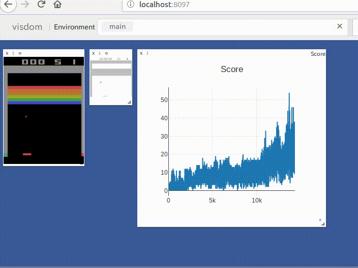
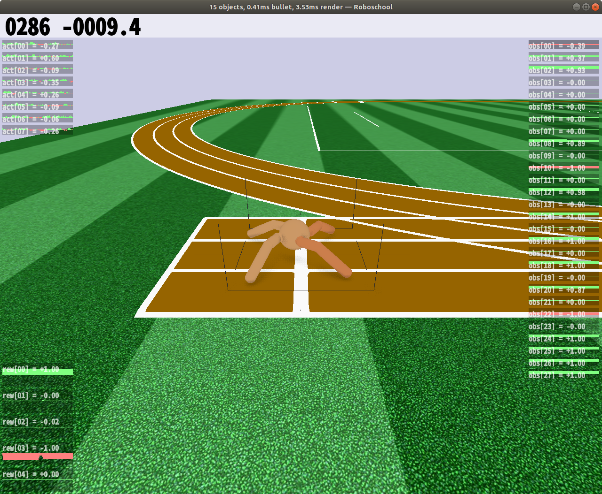

# player_zoo

Implementation of Reinforcement learning algorithms.

## Install

```
git clone https://github.com/neka-nat/player_zoo.git --recursive
```

Install bullet physics depended by roboschool.

```
export ROBOSCHOOL_PATH=<your roboschool path>
cd player_zoo/roboschool
git clone https://github.com/olegklimov/bullet3 -b roboschool_self_collision
mkdir -p bullet3/build
cd    bullet3/build
cmake -DBUILD_SHARED_LIBS=ON -DUSE_DOUBLE_PRECISION=1 -DCMAKE_INSTALL_PREFIX:PATH=$ROBOSCHOOL_PATH/roboschool/cpp-household/bullet_local_install -DBUILD_CPU_DEMOS=OFF -DBUILD_BULLET2_DEMOS=OFF -DBUILD_EXTRAS=OFF  -DBUILD_UNIT_TESTS=OFF -DBUILD_CLSOCKET=OFF -DBUILD_ENET=OFF -DBUILD_OPENGL3_DEMOS=OFF ..
make -j4
make install
cd ../../..
```

Install python packages.

```
pipenv install
```

Run visdom server.

```
pipenv shell
python -m visdom.server
```

## Agents

### DQN

* https://arxiv.org/abs/1312.5602

### Double DQN

* https://arxiv.org/abs/1509.06461

### Dueling DQN

* https://arxiv.org/abs/1511.06581

### Prioritized Experience Replay

* https://arxiv.org/abs/1511.05952

### A3C

* https://arxiv.org/abs/1602.01783

### DDPG

* https://arxiv.org/abs/1509.02971

### TRPO

* https://arxiv.org/abs/1502.05477

### CEM

* http://learning.mpi-sws.org/mlss2016/slides/2016-MLSS-RL.pdf

## Images




